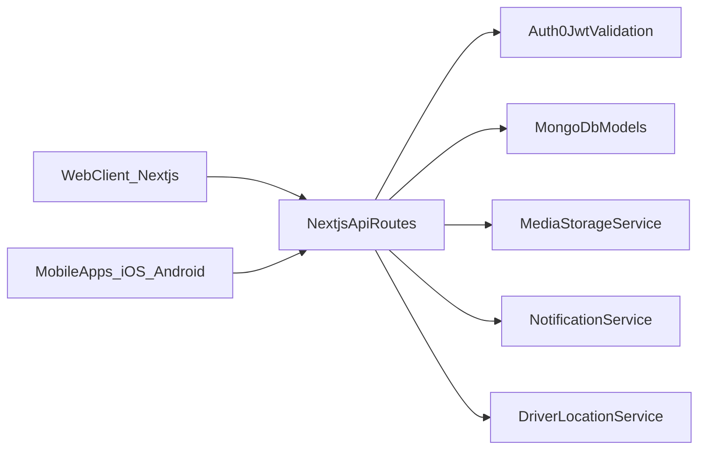

# Meal Planning Delivery Platform Plan

## Scope And Assumptions

- Build new existing Next.js app at [c:/Git/NutrimotionV1/NutrimotionWeb](c:/Git/Nutrimotion/Nutrimotion) (workspace root `NutrimotionV1` appears empty).
- App will be build in TDD
- Use material ui for web
- Authentication uses Auth0; users may have multiple personas (Administrator,  Client, Driver).
- Mobile apps are native (`Swift` + `Kotlin`) consuming secured API endpoints from Next.js backend.
- Initial checkout is custom/manual (no payment gateway integration in phase 1), with discount-code support.

## Target Architecture

- **Web:** Next.js App Router + TypeScript + Redux Toolkit + Redux-Saga + responsive design system.
- **APIs:** Next.js Route Handlers (`/api/*`) with RBAC/permission middleware.
- **Data:** MongoDB (Mongoose) for users, personas, products, subscriptions, carts, orders, delivery tracking, media metadata.
- **Auth:** Auth0 OIDC + JWT; role/persona claims mapped to app permissions.
- **Mobile:** Native iOS/Android apps authenticate via Auth0 and call the same API surface.
- **Media:** Large files uploaded to cloud object storage; metadata and access rules stored in MongoDB.
- **Notifications:** Email + WhatsApp + push notifications via an event-driven notification service.

## Core Domain Model

- **Identity & Access**
  - `User`: profile, auth0Sub, contact info, device fingerprints.
  - `PersonaAssignment`: userId + one/many roles.
  - `Permission`: granular menu/action permissions.
- **Catalog & Content**
  - `MealPackage`, `TrainingPackage`, `Book`, `Recipe`, `VideoAsset`.
  - `MealSchedule`: meals by date and by slot (breakfast/lunch/dinner).
- **Commerce**
  - `Cart`, `CartItem`, `Order`, `OrderItem`, `DiscountCode`, `Subscription`.
- **Delivery**
  - `DeliveryBatch` (same-time meal prep), `DeliveryAssignment` (driver mapping), `DeliveryTrackingPoint`, `DeliveryStatusHistory`.
- **Messaging**
  - `NotificationEvent` queue entries for email/WhatsApp/push.

## Access Control And Menu Rules

- Implement RBAC + permission matrix:
  - Personas: Administrator, Patient, Driver.
  - Menu item visible only when user has permission **and** target module has content.
  - Each menu item stores icon key and route; no empty-content menu items rendered.
- Enforce permissions at both UI and API middleware layers.

## Product Flows

- **Public/Logged-in navigation**
  - Tabs: Home (quick links), Training, Meals, Books.
  - Add-to-cart and checkout with discount code entry.
- **Client (Patient) flow**
  - Save profile (name, address, phone) for checkout.
  - View subscriptions, purchased meals, and order statuses (`purchased -> preparing -> out_for_delivery -> delivered`).
  - Live map view when status is `out_for_delivery`.
- **Administrator flow**
  - Calendar-based meal scheduling, multi-upload for breakfast/lunch/dinner entries.
  - Upload meal image/description/cost/Instagram link.
  - Upload books (PDF), videos, recipes, training packages.
  - Update meal status in batch and assign delivery driver.
  - Batch updates notify all purchasers of that meal.
- **Driver flow**
  - View assigned deliveries with customer name/address/phone.
  - Select active client delivery, share live location, mark arrived/delivered.
  - Trigger email + WhatsApp on arrival.

## API Surface (Initial)

- Auth/profile: `/api/auth/callback`, `/api/users/me`, `/api/users/me/profile`.
- Catalog: `/api/meals`, `/api/training`, `/api/books`, `/api/recipes`, `/api/videos`.
- Cart/checkout: `/api/cart`, `/api/cart/items`, `/api/checkout`, `/api/discount/validate`.
- Orders/subscriptions: `/api/orders`, `/api/subscriptions`.
- Admin scheduling/content: `/api/admin/meals/schedule`, `/api/admin/uploads/*`, `/api/admin/assignments`.
- Delivery: `/api/driver/assignments`, `/api/driver/location`, `/api/driver/status`, `/api/client/tracking/:orderId`.

## Storage And DRM Strategy

- **Phase 1 (MVP):** signed URLs, short-lived tokens, watermarking for PDFs/videos, per-device registration checks.
- **Phase 2 (hard DRM):** integrate platform-specific DRM (Apple FairPlay, Widevine, PlayReady) and licensed PDF DRM provider.
- Locking content to device requires device registration service and license checks per download/open.

## Implementation Phases

1. **Foundation:** Auth0, MongoDB models, Redux-Saga architecture, responsive shell/theme system.
2. **Commerce core:** catalog, cart, checkout, discount code, subscriptions.
3. **Role portals:** admin upload/scheduling panel, client dashboard, driver console.
4. **Delivery tracking:** real-time driver location, map integration, status events.
5. **Content security:** signed delivery, watermarking, device binding baseline.
6. **Native apps:** iOS/Android apps with Auth0 login, catalog/cart/order tracking, driver workflow.
7. **Production hardening:** auditing, observability, rate limiting, backup/recovery, QA/UAT.

## Proposed File/Module Layout (Web + API)

- [c:/Git/Nutrimotion/Nutrimotion/app](c:/Git/Nutrimotion/Nutrimotion/app): route groups for public/client/admin/driver views.
- [c:/Git/Nutrimotion/Nutrimotion/src/store](c:/Git/Nutrimotion/Nutrimotion/src/store): Redux Toolkit store, saga middleware, domain sagas.
- [c:/Git/Nutrimotion/Nutrimotion/src/lib/auth](c:/Git/Nutrimotion/Nutrimotion/src/lib/auth): Auth0 helpers, role claim mapping, permission guards.
- [c:/Git/Nutrimotion/Nutrimotion/src/lib/db](c:/Git/Nutrimotion/Nutrimotion/src/lib/db): Mongo connection + Mongoose models.
- [c:/Git/Nutrimotion/Nutrimotion/src/lib/services](c:/Git/Nutrimotion/Nutrimotion/src/lib/services): uploads, notifications, delivery orchestration.
- [c:/Git/Nutrimotion/Nutrimotion/app/api](c:/Git/Nutrimotion/Nutrimotion/app/api): endpoint handlers + middleware wrappers.

## Quality And Acceptance

- Role-based access tests: menu visibility and API denial for unauthorized personas.
- Checkout tests: cart totals, discount validation, order state transitions.
- Delivery tests: assignment, live location propagation, arrived/delivered notifications.
- Media tests: upload validation, entitlement checks, device-bound access behavior.
- Responsive tests: key screens on mobile, tablet, desktop breakpoints.

